# ProdRec - Product Recommendation Platform


A modern, full-featured product recommendation platform built with React, Vite, and Firebase. Users can query products, receive and give recommendations, manage their queries and recommendations, and interact with an intelligent chatbot system.

## 📑 Table of Contents

- [Features](#-features)
  - [Core Features](#core-features)
  - [UI/UX Features](#uiux-features)
- [Architecture](#-architecture)
  - [System Architecture](#system-architecture)
  - [Design Patterns](#design-patterns)
- [Folder Structure](#-folder-structure)
- [Installation & Setup](#-installation--setup)
  - [Prerequisites](#prerequisites)
  - [Step-by-Step Installation](#step-1-clone-the-repository)
- [Dependencies](#-dependencies)
- [API Configuration](#-api-configuration)
- [Security Features](#-security-features)
- [Styling & Theme](#-styling--theme)
- [Chatbot Integration](#-chatbot-integration)
- [Additional Features](#-additional-features)
- [Browser Support](#-browser-support)
- [Contributing](#-contributing)
- [License](#-license)
- [Developer Information](#-developer-information)
- [Support & Contact](#-support--contact)
- [Roadmap](#-roadmap)

## 🌟 Features

### Core Features
- **User Authentication**
  - Email/Password registration and login
  - Google OAuth integration
  - Secure JWT token-based API communication
  - Automatic logout on unauthorized access (401/403)

- **Product Query Management**
  - Create product queries with detailed information
  - View all queries with pagination/filtering
  - Edit and delete your own queries
  - Search and browse all product queries
  - Get detailed query information with recommendations

- **Recommendation System**
  - Give product recommendations on queries
  - View all recommendations given by you
  - Browse recommendations suggested for you
  - Real-time recommendation updates
  - Track recommendation metrics

- **User Profile & Dashboard**
  - User profile management
  - My Queries dashboard
  - My Recommendations tracking
  - Recommendations for Me section

### UI/UX Features
- **Theme Support**
  - Light and Dark mode toggle
  - Persistent theme preference
  - Smooth theme transitions

- **Real-time Information Display**
  - Current date and time display
  - Live weather information (Dhaka region)
  - Responsive design with mobile optimization

- **Interactive Components**
  - AI Chatbot for user assistance
  - Browse recent queries with Swiper carousel
  - FAQ section with rich content
  - Community section
  - Toast notifications for user feedback
  - Sweet Alert modals for confirmations

- **Accessibility & Performance**
  - Scroll-to-top functionality
  - AOS (Animate on Scroll) animations
  - Optimized bundle with Vite
  - ESLint code quality checks

## 🏗️ Architecture

### System Architecture

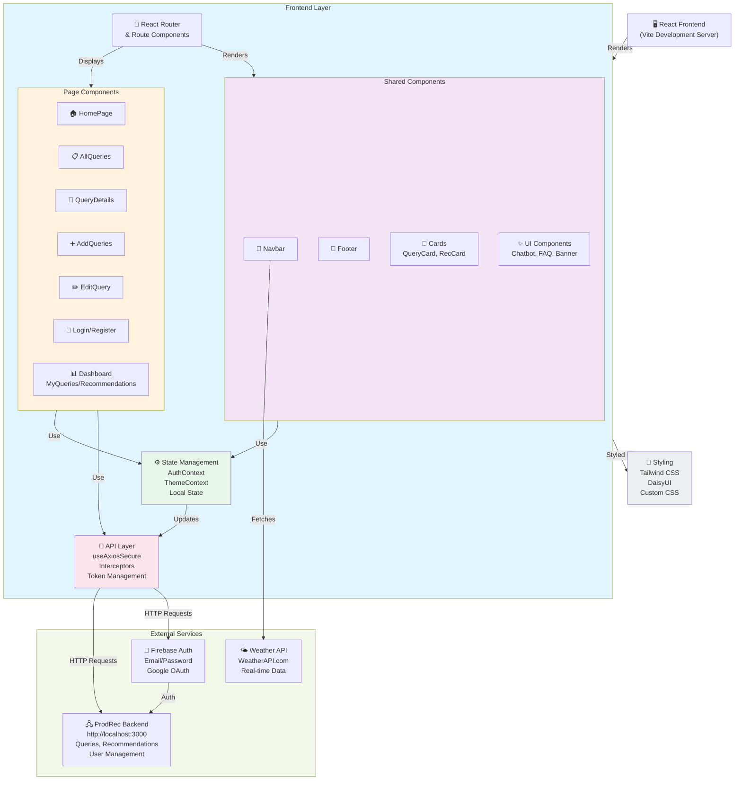

### Data Flow Architecture

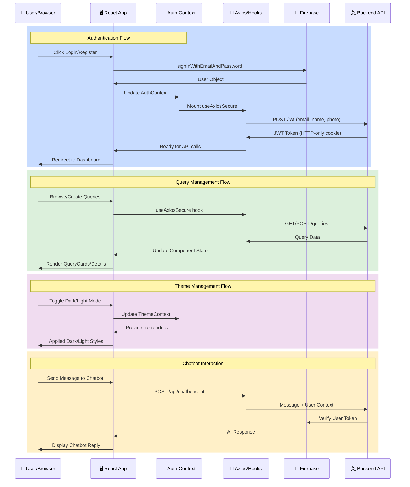

### Component Hierarchy & State Flow

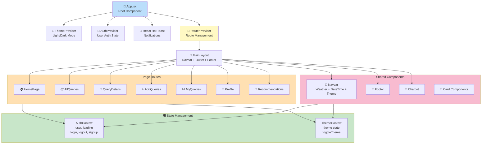

### Authentication Flow

```mermaid
flowchart LR
    A["👤 User Visits App"] --> B{User<br/>Authenticated?}
    
    B -->|No| C["🔐 Sign In/Register"]
    C --> D["🔑 Firebase Auth"]
    D --> E["✅ Get User Object"]
    
    E --> F["📡 Call JWT Endpoint"]
    F --> G["🖧 Backend Creates Token"]
    G --> H["🍪 Token in HTTP-only Cookie"]
    
    H --> I["🎛️ Update AuthContext"]
    I --> J["📝 useAxiosSecure Ready"]
    J --> K["✅ User Authenticated"]
    
    B -->|Yes| K
    K --> L["🏠 Access Protected Routes"]
    
    L --> M["📋 Browse/Create Queries"]
    M --> N["💬 Give Recommendations"]
    N --> O["🤖 Chat with Chatbot"]
    O --> P["👤 View Profile"]
    
    M --> Q{User Action}
    Q -->|Creates| R["➕ POST /queries"]
    Q -->|Reads| S["📖 GET /queries"]
    Q -->|Updates| T["✏️ PUT /query/:id"]
    Q -->|Deletes| U["🗑️ DELETE /query/:id"]
    
    R --> V["🔒 useAxiosSecure<br/>Adds Auth Header"]
    S --> V
    T --> V
    U --> V
    
    V --> W["🖧 Request to Backend"]
    W --> X["🔐 Verify JWT"]
    X --> Y{Valid?}
    Y -->|Yes| Z["⚙️ Process Request"]
    Y -->|No| AA["❌ 401/403 Error"]
    
    AA --> AB["🚪 Force Logout"]
    AB --> C
    
    Z --> AC["📊 Database Operation"]
    AC --> AD["✅ Success Response"]
    AD --> AE["🎨 Update Component"]
    AE --> AF["📢 Toast Notification"]
    
    style A fill:#e3f2fd
    style K fill:#c8e6c9
    style V fill:#fff9c4
    style Z fill:#f8bbd0
    style AF fill:#e8f5e9
```

### State Management Architecture

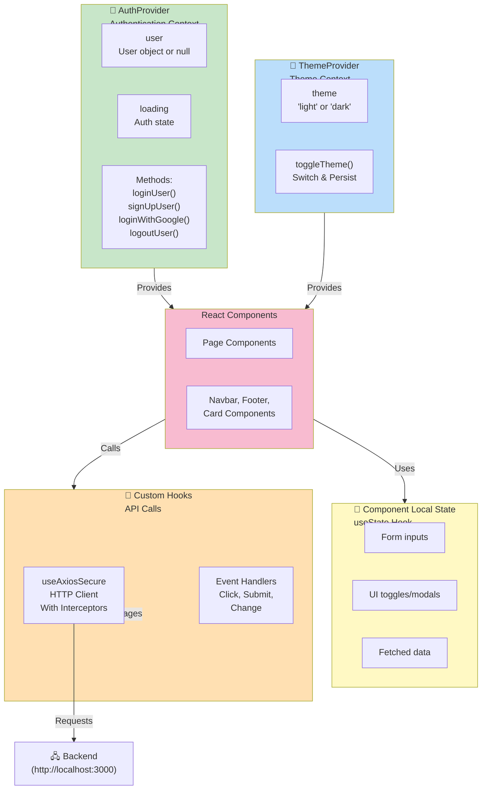

### API Request Flow with Interceptors

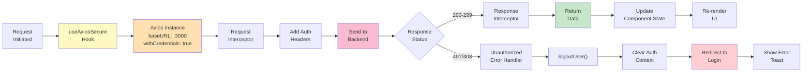

### Design Patterns

- **Component-Based Architecture**: Modular, reusable React components organized by functionality
- **Context API Pattern**: Global state management for Auth and Theme with Provider pattern
- **Custom Hooks**: `useAxiosSecure` for centralized API communication with interceptors
- **Protected Routes**: Private route wrapper (`PrivateRoute`) prevents unauthorized access
- **Provider Pattern**: Multiple context providers wrapped around the app for state distribution
- **Layout Pattern**: Main layout component wraps pages with navbar, footer, and chatbot
- **Compound Component Pattern**: Cards and UI components composed from smaller pieces
- **Fetch-on-Mount Pattern**: Data loading via React Router loaders and useEffect hooks

## 📁 Folder Structure

```
prod_rec/
├── src/
│   ├── pages/                          # Page components
│   │   ├── HomePage.jsx                # Landing page with features
│   │   ├── AllQueries.jsx              # Browse all product queries
│   │   ├── QueryDetails.jsx            # Detailed query view
│   │   ├── AddQueries.jsx              # Create new query
│   │   ├── EditQuery.jsx               # Edit existing query
│   │   ├── MyQueries.jsx               # User's queries dashboard
│   │   ├── MyRecommendations.jsx       # User's given recommendations
│   │   ├── RecommendationsForMe.jsx    # Recommendations received
│   │   ├── Profile.jsx                 # User profile page
│   │   ├── Login.jsx                   # User login
│   │   ├── Register.jsx                # User registration
│   │   └── ErrorPage.jsx               # Error handling page
│   │
│   ├── components/                     # Reusable components
│   │   ├── Banner.jsx                  # Hero banner section
│   │   ├── Navbar/
│   │   │   ├── Navbar.jsx              # Navigation bar
│   │   │   └── Navbar.css              # Navbar styles
│   │   ├── Footer.jsx                  # Footer section
│   │   ├── Chatbot.jsx                 # AI chatbot component
│   │   ├── Faq.jsx                     # FAQ section
│   │   ├── Community.jsx               # Community section
│   │   ├── Find.jsx                    # Find/Search section
│   │   ├── RecentQueries.jsx           # Recent queries carousel
│   │   ├── CommentSwiper.jsx           # Comment swiper carousel
│   │   ├── ScrollToTop.jsx             # Scroll to top button
│   │   ├── Slide.jsx                   # Slide component
│   │   └── Cards/                      # Card components
│   │       ├── QueryCard.jsx           # Query card display
│   │       ├── CommentCard.jsx         # Comment card
│   │       ├── MyQueriesCard.jsx       # User's query card
│   │       └── RecommendationCard.jsx  # Recommendation card
│   │
│   ├── layouts/                        # Layout components
│   │   └── MainLayout.jsx              # Main app layout
│   │
│   ├── routes/                         # Routing configuration
│   │   ├── AppRoutes.jsx               # Route definitions
│   │   └── PrivateRoute.jsx            # Protected route wrapper
│   │
│   ├── provider/                       # Context providers
│   │   ├── AuthProvider.jsx            # Authentication context
│   │   └── ThemeProvider.jsx           # Theme context (Light/Dark)
│   │
│   ├── hooks/                          # Custom hooks
│   │   └── useAxiosSecure.jsx          # Secure API call hook
│   │
│   ├── firebase/                       # Firebase configuration
│   │   └── firebase.config.js          # Firebase setup
│   │
│   ├── assets/                         # Static assets
│   │   └── [images, icons, etc.]
│   │
│   ├── App.jsx                         # Root component
│   ├── App.css                         # Root styles
│   ├── main.jsx                        # Entry point
│   └── index.css                       # Global styles
│
├── public/
│   └── [static files]
│
├── Configuration Files
│   ├── package.json                    # Dependencies & scripts
│   ├── vite.config.js                  # Vite configuration
│   ├── tailwind.config.js              # Tailwind CSS configuration
│   ├── postcss.config.js               # PostCSS configuration
│   ├── eslint.config.js                # ESLint configuration
│   ├── index.html                      # HTML entry point
│   ├── .env                            # Environment variables
│   └── .gitignore                      # Git ignore rules
```

## � API Integration with Backend

### Frontend-Backend Communication Architecture

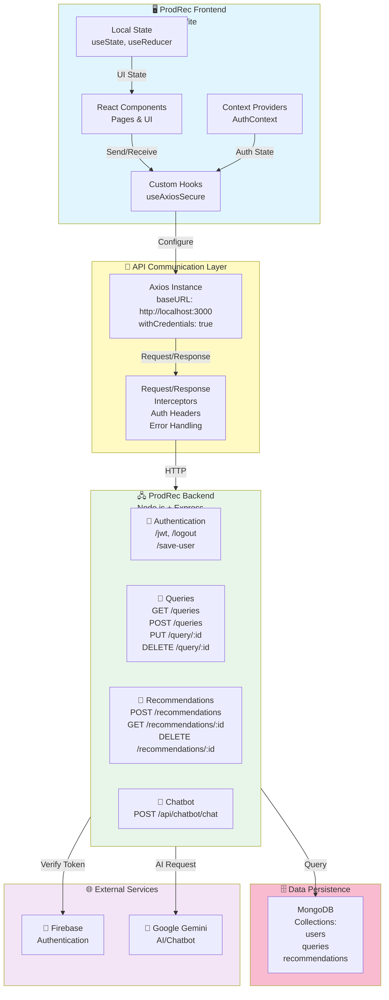

### API Endpoint Integration Map

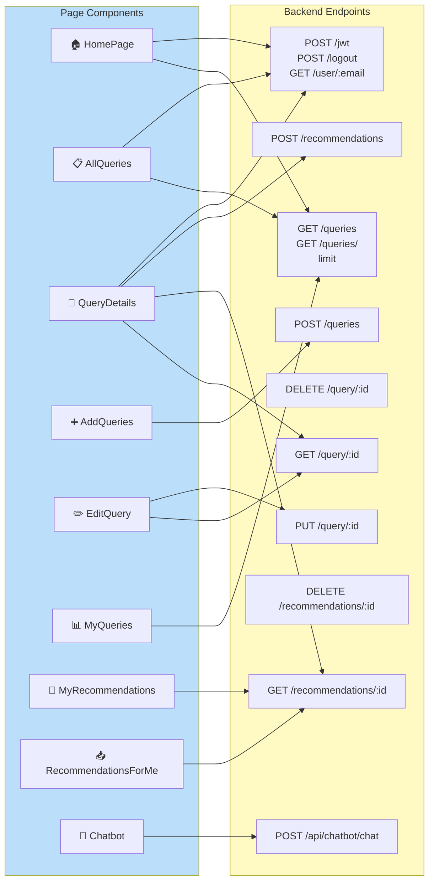

### Request/Response Lifecycle

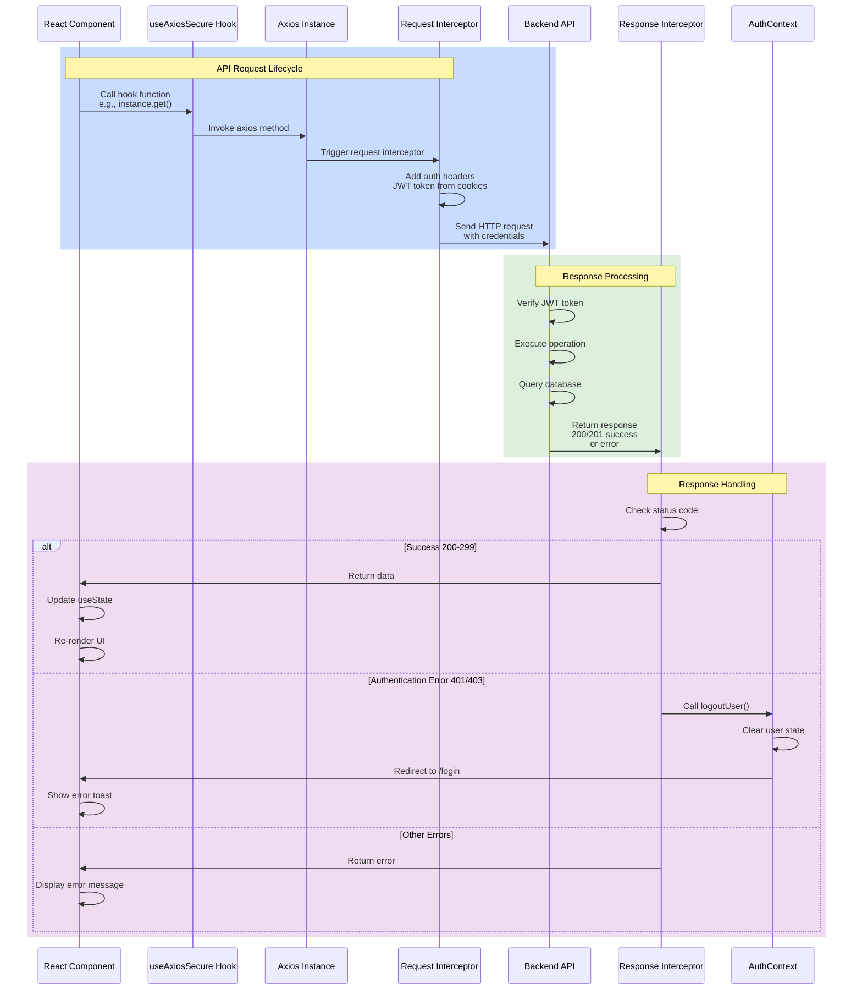

### useAxiosSecure Hook Implementation Pattern

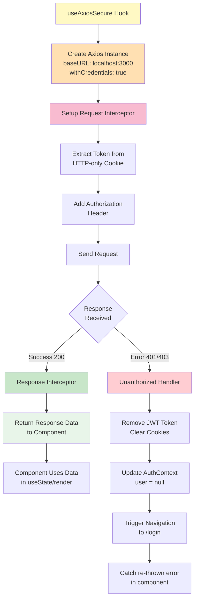

## �🚀 Installation & Setup

### Prerequisites
- **Node.js** (v16 or higher)
- **npm** or **yarn** package manager
- **Git** for version control

### Step 1: Clone the Repository
```bash
git clone https://github.com/ferdause-al-mahmud/prod_rec.git
cd prod_rec
```

### Step 2: Install Dependencies
```bash
npm install
# or
yarn install
```

### Step 3: Environment Configuration
Create a `.env` file in the root directory and add your Firebase credentials:

```env
VITE_apiKey=YOUR_FIREBASE_API_KEY
VITE_authDomain=YOUR_FIREBASE_AUTH_DOMAIN
VITE_projectId=YOUR_FIREBASE_PROJECT_ID
VITE_storageBucket=YOUR_FIREBASE_STORAGE_BUCKET
VITE_messagingSenderId=YOUR_FIREBASE_MESSAGING_SENDER_ID
VITE_appId=YOUR_FIREBASE_APP_ID
```

**Note**: Obtain these credentials from your Firebase project console.

### Step 4: Start Development Server
```bash
npm run dev
# or
yarn dev
```

The application will open automatically at `http://localhost:5173`

### Step 5: Build for Production
```bash
npm run build
# or
yarn build
```

### Step 6: Preview Production Build
```bash
npm run preview
# or
yarn preview
```

### Code Quality Checks
```bash
npm run lint
# or
yarn lint
```

## 📦 Dependencies

### Core Dependencies
| Package | Version | Purpose |
|---------|---------|---------|
| `react` | 18.3.1 | UI library |
| `react-dom` | 18.3.1 | DOM rendering |
| `react-router-dom` | 7.1.0 | Client-side routing |
| `vite` | 6.0.3 | Build tool & dev server |

### Authentication & Database
| Package | Version | Purpose |
|---------|---------|---------|
| `firebase` | 11.1.0 | Authentication & backend |

### HTTP & API
| Package | Version | Purpose |
|---------|---------|---------|
| `axios` | 1.13.3 | HTTP client |

### UI & Styling
| Package | Version | Purpose |
|---------|---------|---------|
| `tailwindcss` | 3.4.17 | Utility-first CSS framework |
| `daisyui` | 4.12.22 | Component library for Tailwind |
| `react-icons` | 5.4.0 | Icon library |
| `lucide-react` | 0.563.0 | SVG icon library |

### Notifications & UI Components
| Package | Version | Purpose |
|---------|---------|---------|
| `react-hot-toast` | 2.4.1 | Toast notifications |
| `sweetalert2` | 11.15.3 | Modal alerts |
| `swiper` | 11.1.15 | Carousel component |
| `react-tooltip` | 5.28.0 | Tooltip component |

### Date & Time
| Package | Version | Purpose |
|---------|---------|---------|
| `date-fns` | 4.1.0 | Date utilities |
| `react-datepicker` | 7.5.0 | Date picker component |
| `react-date-object` | 2.1.9 | Date object handling |

### Animations & Utilities
| Package | Version | Purpose |
|---------|---------|---------|
| `aos` | 2.3.4 | Scroll animations |

### Development Dependencies
- **ESLint**: Code quality and consistency
- **Autoprefixer**: CSS vendor prefixes
- **PostCSS**: CSS transformations

## 🔌 API Configuration

The application communicates with a backend API at:
```
Base URL: http://localhost:3000
```

### Key API Endpoints (Examples)
- `GET /queries-limit/?limit=6` - Get limited queries
- `GET /query/:id` - Get query details
- `POST /save-user` - Save user data
- `PUT /query/:id` - Update query
- `DELETE /query/:id` - Delete query

**Note**: Update the API base URL in configuration files for different environments (development, staging, production).

## 🛡️ Security Features

- **Firebase Authentication**: Secure user registration and login
- **Google OAuth**: Third-party authentication
- **Protected Routes**: Private route wrapper prevents unauthorized access
- **Axios Interceptors**: Automatic token management and error handling
- **Environment Variables**: Sensitive data stored in `.env` file
- **Token Expiry Handling**: Automatic logout on unauthorized access

## 🎨 Styling & Theme

- **Tailwind CSS**: Utility-first CSS framework for rapid UI development
- **DaisyUI**: Pre-built components on top of Tailwind
- **Dark Mode Support**: Toggle between light and dark themes
- **Responsive Design**: Mobile-first, works on all screen sizes
- **Custom CSS**: Additional styles in respective component files

## 🤖 Chatbot Integration

ProdRec includes an intelligent chatbot component (`Chatbot.jsx`) for:
- User assistance and support
- Product recommendations guidance
- FAQs and help information
- User engagement

## 🌍 Additional Features

### Weather Integration
- Real-time weather display for Dhaka, Bangladesh
- Uses WeatherAPI.com for live weather data
- Displays temperature, condition, and location

### DateTime Display
- Current date and time
- Updates every minute
- Formatted with locale-specific options

### Animations
- AOS (Animate on Scroll) library
- Smooth page transitions
- Interactive component animations
- Hover effects and transitions

## 🎯 Features Architecture

### Feature Organization Map

```mermaid
graph TB
    subgraph Auth["🔐 Authentication Module"]
        FirebaseAuth["Firebase Auth<br/>Email/Password<br/>Google OAuth"]
        JWTAuth["JWT Token<br/>HTTP-only Cookies<br/>Axios Interceptors"]
        ProtectedRoutes["Protected Routes<br/>PrivateRoute Wrapper<br/>Auth Guards"]
    end
    
    subgraph QueryMgmt["📝 Query Management"]
        Browse["Browse Queries<br/>AllQueries.jsx<br/>Search & Filter"]
        Create["Create Query<br/>AddQueries.jsx<br/>Form Validation"]
        View["View Details<br/>QueryDetails.jsx<br/>Recommendations"]
        Edit["Edit Query<br/>EditQuery.jsx<br/>Update Form"]
        MyQueries["My Queries<br/>MyQueries.jsx<br/>User Dashboard"]
    end
    
    subgraph RecMgmt["💬 Recommendation System"]
        GiveRec["Give Recommendation<br/>QueryDetails.jsx<br/>Recommendation Form"]
        ViewRec["View Recommendations<br/>MyRecommendations.jsx<br/>Received Recs"]
        RecForMe["Recommendations for Me<br/>RecommendationsForMe.jsx<br/>User Dashboard"]
        RecStats["Recommendation Stats<br/>Counter + Display<br/>Leaderboard"]
    end
    
    subgraph UI["🎨 UI/UX Features"]
        Theme["Theme Management<br/>Light/Dark Toggle<br/>ThemeContext"]
        Weather["Weather Widget<br/>Real-time Data<br/>Navbar Display"]
        DateTime["Date/Time Display<br/>Live Updates<br/>Locale Formatting"]
        Notifications["Toast Notifications<br/>React Hot Toast<br/>User Feedback"]
        Modal["Sweet Alert Modals<br/>Confirmations<br/>Info Dialogs"]
    end
    
    subgraph Chat["🤖 AI Chatbot"]
        ChatUI["Chat Interface<br/>Message Input<br/>Response Display"]
        Integration["Gemini Integration<br/>Backend API<br/>Context Awareness"]
        History["Message History<br/>User Context<br/>Personalization"]
    end
    
    subgraph Components["🎴 Reusable Components"]
        Cards["Card Components<br/>QueryCard<br/>RecCard<br/>CommentCard"]
        Navbar["Navigation Bar<br/>Theme Toggle<br/>User Info"]
        Footer["Footer<br/>Links<br/>Info"]
        Carousel["Carousel<br/>Swiper Integration<br/>Image Display"]
    end
    
    Auth --> JWTAuth
    QueryMgmt --> Create
    QueryMgmt --> Browse
    RecMgmt --> GiveRec
    RecMgmt --> ViewRec
    UI --> Theme
    UI --> Weather
    Chat --> Integration
    Components --> Cards
    
    style Auth fill:#c8e6c9
    style QueryMgmt fill:#bbdefb
    style RecMgmt fill:#fff9c4
    style UI fill:#ffe0b2
    style Chat fill:#f8bbd0
    style Components fill:#f3e5f5
```

### Feature Implementation Flow

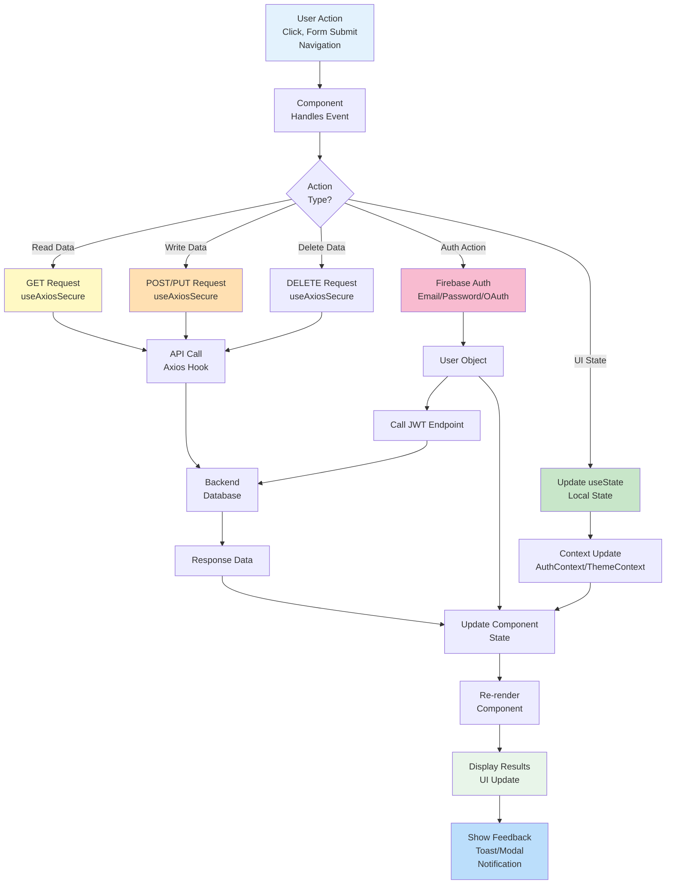

### Component Feature Matrix

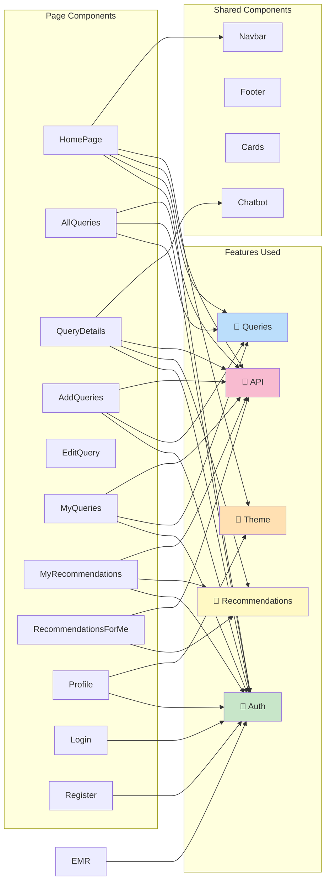

## 📱 Browser Support

- Chrome (latest)
- Firefox (latest)
- Safari (latest)
- Edge (latest)
- Mobile browsers iOS/Android

## 🤝 Contributing

Contributions are welcome! Please follow these steps:

1. Fork the repository
2. Create a feature branch (`git checkout -b feature/AmazingFeature`)
3. Commit your changes (`git commit -m 'Add some AmazingFeature'`)
4. Push to the branch (`git push origin feature/AmazingFeature`)
5. Open a Pull Request

## 📄 License

This project is licensed under the MIT License - see the LICENSE file for details.

## 👨‍💻 Developer Information

- **Project Name**: ProdRec (Product Recommendation Platform)
- **Repository**: [ferdause-al-mahmud/prod_rec](https://github.com/ferdause-al-mahmud/prod_rec)
- **Backend Repository**: [ferdause-al-mahmud/prod_rec-backend](https://github.com/ferdause-al-mahmud/prod_rec-backend)
- **Current Branch**: mahin
- **Default Branch**: main

## 📞 Support & Contact

For support, questions, or feedback:
- Open an issue on GitHub
- Contact the development team
- Check the FAQ section in the application

## 🗺️ Roadmap

- [ ] Advanced search filters
- [ ] User ratings and reviews
- [ ] Email notifications
- [ ] Social sharing features
- [ ] Mobile app (React Native)
- [ ] API documentation
- [ ] Performance optimization
- [ ] Internationalization (i18n)

---

**Built with ❤️ using React, Vite, Firebase, and Tailwind CSS**

## 📚 Related Repositories

- **Backend API**: [ProdRec Backend Server](https://github.com/ferdause-al-mahmud/prod_rec-backend)
  - Node.js + Express API
  - MongoDB Database
  - JWT Authentication
  - Google Generative AI Integration
